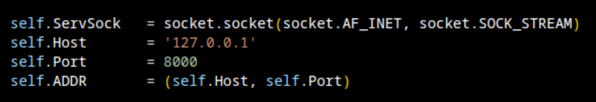

<style>
    body {
    	height: 100vh;
	    --sz: 7px; /*** size ***/
    	--c0: #020202;
    	--c1: #171b1f;
        --c2: #333333;
        --c3: #00ff0095;
        --ts: 50%/ calc(var(--sz) * 16.8) calc(var(--sz) * 22);
        background:
		/*bottom*/
        conic-gradient(from 120deg at 50% 86.5%, var(--c1) 0 120deg, #fff0 0 360deg) var(--ts),
        conic-gradient(from 120deg at 50% 86.5%, var(--c1) 0 120deg, #fff0 0 360deg) var(--ts),
		/*bottom dark*/
		conic-gradient(from 120deg at 50% 74%, var(--c0) 0 120deg, #fff0 0 360deg) var(--ts),
		/*right*/
		conic-gradient(from 60deg at 60% 50%, var(--c1) 0 60deg, var(--c2) 0 120deg, #fff0 0 360deg) var(--ts),
		/*left*/
		conic-gradient(from 180deg at 40% 50%, var(--c3) 0 60deg, var(--c1) 0 120deg, #fff0 0 360deg) var(--ts),
		/*top dark*/
        conic-gradient(from 0deg at 90% 35%, var(--c0) 0 90deg, #fff0 0 360deg) var(--ts),
        conic-gradient(from -90deg at 10% 35%, var(--c0) 0 90deg, #fff0 0 360deg) var(--ts),
        conic-gradient(from 0deg at 90% 35%, var(--c0) 0 90deg, #fff0 0 360deg) var(--ts),
        conic-gradient(from -90deg at 10% 35%, var(--c0) 0 90deg, #fff0 0 360deg) var(--ts),
	    	/*top*/
        conic-gradient(from -60deg at 50% 13.5%, var(--c1) 0 120deg, #fff0 0 360deg) var(--ts),
        conic-gradient(from -60deg at 50% 13.5%, var(--c1) 0 120deg, #fff0 0 360deg) var(--ts),
		conic-gradient(from -60deg at 50% 41%, var(--c2) 0 60deg, var(--c3) 0 120deg, #fff0 0 360deg) var(--ts),
		var(--c0) ;
    }


    p {
        font-size: medium;
    }


    .da-head {
        margin-top: -15px;
        margin-left: -40%;
        margin-right: -10%;
        width: 100wv;
        height: fit-content;
        padding-left: 20%; 
        padding-right: 15%;
        padding-top: 1px;
        padding-bottom: 10px;
        border-radius: 20px;
        background-color: #111111F5;
        color: white;
        box-shadow: 10px 8px 10px 5px #00ff00;

    }

    .midspan  {
        margin-top: 10px;
        margin-left: -40%;
        margin-right: -10%;
        width: 90wv;
        height: 90wv;
        padding-left: 25%; 
        padding-right: 10%;
        padding-top: 5px;
        padding-bottom: 5px;
        border-radius: 20px;
        background-color: #111111F7;
        color: white;
        box-shadow: 10px 8px 10px 5px #00ff00;

    }
    .code_it {
        font-size: small;
        padding-top: 5px;
        padding-bottom: 5px;
        padding-left: 15px; 
        width: 80wv;
        right: 5vw; 
        height: fit-content;
        padding: 5px 80wv; 
        background-color: black; /* linear-gradient(-45deg, #9834eb, #e73c7e, #23a6d5, #23d5ab); ; */
        color: white;
        border-radius: 20px;
    }

    .segment {
        display: box;
        width: 80wv;
        right: 5vw; 
        height: fit-content;
        padding: 5px 80wv; 
        background-color: black; 
        color: #00ff00F2;
        border-radius: 5px;
        padding-left: 2px; 
        padding-top: 0;
        padding-bottom: 1px;
        font-size: small;


    }

    .tb_sh_0 {
        width: 70vw;
        background: linear-gradient(-45deg, #9834eb, #e73c7e, #23a6d5, #23d5ab);
        border-radius: 15px;
        padding-top: 5px;
        padding-bottom: 5px;
    }


    .tb_box {
        margin-left: 1%;
        margin-right: 1%;
        padding-top: 1%;
        padding-bottom: 1%;

        width: 98%;
        height: calc(fit-content + 5px);
        background-color: black;
        border-radius: 14px;
        display: flex;
    }

    .tb_sh_1 {
        margin-left: -21px;
        width: 80vw;
        background: linear-gradient(-45deg, #9834eb, #e73c7e, #23a6d5, #23d5ab);
        border-radius: 10px;
        padding-top: 1px;
        padding-bottom: 1px;
    }

    .snippet{
        padding-left: 0%;
        margin-right: 2px;
        margin-left: 1px;
        padding-top: 1px;
        margin-top: 1px;
        width: 100%;
        height: fit-content;
        background-color: black;
        border-radius: 12px;

    }
    .snippet img {
        border-radius: 12px;
    }


    li {
        margin-left: -15px;
        font-size: small;
        list-style-type: none; 
        color: #00ff00;

        }

    .tb_sh_2 {
        margin-left: -21px;
        width: 80vw;
        background: linear-gradient(-45deg, #9834eb, #e73c7e, #23a6d5, #23d5ab);
        border-radius: 10px;
        padding-top: 1px;
        padding-bottom: 1px;
    }


</style>


<body>

<div class="da-head">
<h2> 
Our First Socks 🧦
</h2>
</div>
<div class="midspan">
<h3> Server Side </h3>
<h4> Concept </h4>
<p>
It wouldn't make much sense to try any make a phone call to someone who doesn't have a phone..
Same with sockets.. We first need an actual socket server with which to connect to.
</p>
<h3> Imports </h3>
<p>
luckily for us, socket should be pre-installed
(Cause it's actually needed for pip..)
So let's start:
</p>
<div class="segment">
<u style="background-color: #111111F7; margin-left: 10px;"> first_tcp_server.py</u>


<div class="code_it">
import socket
</div>

</div>
<br>
<p>
[NOTE] : If you're used to vs-code / code-oss and have the relevant extensions, then you should see the suggestion pop-up..
</p>

</div>
<br>

<br>
<br>
<br>
<br>
<br>
<br>
<div class="midspan">


<h3> The Class </h3>
<p>
It is perceived that if you have been following allong in this series, that I need not explain the need for OOP. If not, feel free to browse the world's greatest "window-shopping-center" also known as google.
</p>

<h3> def __init__ </h3>
<p>
In the init function, we will define and configure our sockets..For this particular example we will be using  socket.AF_INET & socket.SOCK_STREAM. There is a wide range of configurations which can be implemented. Some of the base callbacks which are worth noting in the IPv4 range are:
</p>


<div class="tb_sh_0">
<div class="tb_box">
<ul>
<li>
Family &nbsp; &nbsp; &nbsp; &nbsp; &nbsp; | &nbsp; Description 
</li>

<li>
AF_INET &nbsp; &nbsp; &nbsp; | &nbsp; IPv4 protocols 
</li>

<li>
AF_INET &nbsp; &nbsp; &nbsp; | &nbsp; IPv4 protocols
</li>

<li>
AF_INET6 &nbsp; &nbsp; | &nbsp; IPv6 protocols
</li>

<li>
AF_LOCAL &nbsp;  &nbsp;| &nbsp; Unix domain protocols
</li>

<li>
AF_ROUTE &nbsp;&nbsp;| &nbsp; Routing Sockets 
</li>


</ul>

</div>
</div>
<br>
</div>

<br>
<br>

</div>
</div>

</div>


</div>
<br>


<br>
<br>
<br>
<br>
<br>
<br>
<div class="midspan">


<h5>AF_INET</h5>
<p>-> This address family provides interprocess communication between processes that run on the same system or on different systems.
</p>

<h5>SOCK_STREAM</h5>
<p>
-> In the Internet domain, the SOCK_STREAM socket type is implemented on the Transmission Control Protocol/Internet Protocol (TCP/IP) protocol. A stream socket provides for the bidirectional, reliable, sequenced, and unduplicated flow of data without record boundaries.
[NOTE] :  So in a NutShell; we're saying we want to use TCP/IP..
For a "Client" to 'call', us we will need to 'registered' our "Number", 
</P>


<div class="tb_sh_1">
<div class="snippet">



</div>

</div>

<br>

</div>
<br>
<br>


<div class="midspan">

<h3> def main(self) </h3>

In order to use this bag of socket codes as a _Server_, we must bind the socket.

<div class="tb_sh_2">
<div class="code_it">
self.sock.bind(('', self.port))
</div>
</div>
<br>


In my experience, you're not going to be heard if no-one is listening..

<div class="tb_sh_2">
<div class="code_it">
max_connections = 50
self.sock.listen(max_connections)
</div>
</div>
<br>

Surely, every "Company Building" has a 'front-door' ?
Our 'front-door' will be having an endless 'revolving door'..
Better know as a ```while true``` loop. Each visitor getting their
very own 'thread' which will handle the inbound and outbound traffic
between server and that 'visitor'. In order to achieve this __crochet__, we will need to:

<div class="tb_sh_2">
<div class="code_it">
import threading as thr<br/>
from thr import Thread as Thr
</div>
</div>

<br>

</div>


<br><br><br><br>
<br>
<br>
<br>
<div class="midspan">

<h4> Accepting connections </h4>


<div>
<p> 
It is worth noting that as time goes you are bound to deal with larger amounts of threads
and by nature, threads have a tendency of "sticking around", unless we clean them up..
At the __init__ function add: </p>
<div class="tb_sh_2">
<div class="code_it">
# Let's add some needed variables:<br/>
self.threads    = []<br/>
self.th_count   = 0<br/>
</div>
</div>
</div>
<br>

<p>
From here on, (within the "while True:" Loop), we will be accepting out clients'
requests to connect to the server. To put it mordernly; "the clerk/secretary has now shown
our clients to the other room...
</p>

<div class="tb_sh_2">
<div class="code_it">
conn, addr = self.sock.accept()

<br>
new_thread = Thr(group=None, target=self.handle_client, args=(conn, addr))
<br>
new_thread.start()
<br>
self.threads.append(t1)
<br>
self.th_count+=1
<br>

</div>
</div>


<br>
...this other room being:


</div>

<br><br>
<br><br>


<br>
<br>

<br>
<br>
<br>
<br>


<div class="midspan">


<h3> def handle_clients(self, conn, addr) </h3>

<p>
To avoid the situation where you walk into a room, and it's like there's 
so many people talking over each other, so loudly, you couldn't possibly
order a cup off coffee.. We will use threading events.
First, we initiate it..
</p>

<div class="tb_sh_2">
<div class="code_it">
self.E = thr.Event()
</div>
</div>
<br>
<p>
Then in the next " while True: ", we will first wait 
to recieve the length of a packet which is about to be sent..
</p>


<div class="tb_sh_2">
<div class="code_it">

data_len = int(conn.recv(64).decode())<br>
if not data_len:<br>
 &nbsp; &nbsp; self.E.wait()<br>
if data_len > 0:<br>
 &nbsp; &nbsp; new_data = str(conn.recv(data_len).decode())

</div>
</div>
<br>

<br>


</div>


<br>
<br>
<br>
<br>
<br>
<br>

<div class="midspan">

<h3> Conceptual Differences </h3>

<p>
By first sending the size, we can combat data corruptions and 
broken pipe errors. Which any online gamer will know, is a 
pain. But, TCP (unlike UDP) doesn't easily cause 'build-up' requests. 
But it does depend on what the goal is.. where online games have way 
too much data which become irrelevant very quickly, UDP is fine.
However, if you're making online transactions,, 
    ( well, you don't want any issues the: we got enough)
Once the client have secured a connection and the Client has sent the 
message_len & message_ (packet), the server can now process this data
and determine how to further handle the client.. So if eg. the client
has send "Hello Server!", we can then choose a response for the server
to send back to client, using the same technique/method that client used
to send the data..
</p>

</div>


<br>
<br>
<br>
<br>
<br>
<br>

<div class="midspan">


<h3> def reply(self, conn, data) </h3>

<p>
Now let's not be rude; a 'Client' has sent us a message!
We aught to respond.?
</p>
<br>
<p>
Once it has been determined that the client's connection is following 
procedure, we can then reply.. So same as with the server side,
the client will first be expecting the length of the data, then the 
actual data.
</p>

<br>

<div class="tb_sh_2">
<div class="code_it">
msg_len = len(data)<br>
send_len = str(msg_len).encode()<br>
send_len += b' ' * (64 - len(send_len))<br>
conn.send(send_len)<br>
conn.send(data.encode())<br>
</div>
</div>


<br>

<h3>Next:</h3>
<p> We will build the client side code, and start communicating.
</p>

<br>


</div>

<br>
<br>
<br>
<br>
<br>
<br>
<br>
<br>
<br>
<br>
<br>
<br>
<br>
<br>


</body>