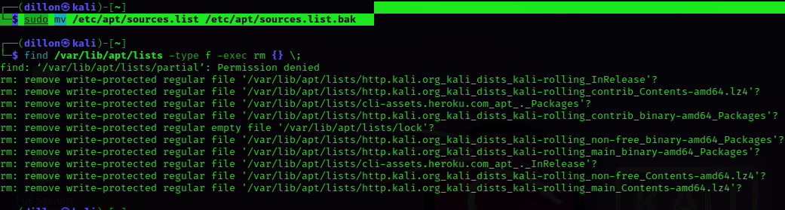

# Install Snort on Kali (2023) # 


<div style="background-color: green"> 

```diff
+       (\____/)
+       / @__@ \
+      (  (oo)  )
+       `-.~~.-'
+       /     \
+     @/       \_
+     (/ /    \ \)
+      WW`----'WW
```
</div>

## Issues ##
 ! Note: 
  snort is no longer available in Kali repositories
 !
  Here are the steps to install snort on Kali:


### Setting Up ###


<div style="background-color: #03fc03"> 

Step 1) 
-Backup kali's sources.list

```
mv /etc/apt/sources.list /etc/apt/sources.list.bak

```





Step 2)
-Remove updates

```
find /var/lib/apt/lists -type f -exec rm {} \;

```


Step 3)
-Change sources.list content

```
sudo vim /etc/apt/sources.list

```


Step 4)
{If Kali is install on your machine}


Paste content given below

```
deb http://archive.ubuntu.com/ubuntu/ focal main restricted universe multiverse
deb-src http://archive.ubuntu.com/ubuntu/ focal main restricted universe multiverse
deb http://archive.ubuntu.com/ubuntu/ focal-updates main restricted universe multiverse
deb-src http://archive.ubuntu.com/ubuntu/ focal-updates main restricted universe multiverse
deb http://archive.ubuntu.com/ubuntu/ focal-security main restricted universe multiverse
deb-src http://archive.ubuntu.com/ubuntu/ focal-security main restricted universe multiverse
deb http://archive.ubuntu.com/ubuntu/ focal-backports main restricted universe multiverse
deb-src http://archive.ubuntu.com/ubuntu/ focal-backports main restricted universe multiverse
deb http://archive.canonical.com/ubuntu focal partner
deb-src http://archive.canonical.com/ubuntu focal partner

```

{If you are using a VM and do not have the ARM repositories in your repo}

```
deb [arch=arm64] http://ports.ubuntu.com/ubuntu-ports focal main restricted universe multiverse
deb [arch=arm64] http://ports.ubuntu.com/ubuntu-ports focal-updates main restricted universe multiverse
deb [arch=arm64] http://ports.ubuntu.com/ubuntu-ports focal-security main restricted universe multiverse
deb [arch=i386,amd64] http://us.archive.ubuntu.com/ubuntu/ focal main restricted universe multiverse
deb [arch=i386,amd64] http://us.archive.ubuntu.com/ubuntu/ focal-updates main restricted universe multiverse
deb [arch=i386,amd64] http://security.ubuntu.com/ubuntu focal-security main restricted universe multiverse

```


Step 5)
-Add the specified public keys 

```
sudo apt-key adv --keyserver keyserver.ubuntu.com --recv-keys 3B4FE6ACC0B21F32
sudo apt-key adv --keyserver keyserver.ubuntu.com --recv-keys 871920D1991BC93C

```

Step 6)
-Update (But, Don't ```upgrade```)

```
sudo apt update

```


Step 7)
-Finally, Install SNORT

```
sudo apt install snort

```
^ This might take a bt of time..


</div>

### Disclosure ###

The point in time by which I am typing this, 
I have yet to revert the 'apt files'
and have no idea the reprocutions of these actions.. LoL/KeK


But, to undo the apt list.. 

```

sudo mv /etc/apt/sources.list.bak /etc/apt/sources.list


``` 

... I now know, once you put the source list back to normal 
You can continue to use apt update && apt upgrade :)...
 


# SSH Server & Client #

<div style="background-color: #0320fc"> 

### Requirements ###

You will require a second machine, so if like me, you don't.. :
  --termux on your phone it could probably also work..


## Get Started ##

Let's install "openssh-server" on the current machine and "openssh-client"


### This Machine ###

- Install..

```
sudo apt-get install openssh-server

```

- Check Status

```
sudo systemctl status ssh

```


- FireWall Config

```
sudo ufw allow ssh

sudo ufw enable

sudo ufw status

```

- Enable 

```
sudo systemctl enable ssh --now

```

- Launch


```
sudo systemctl start ssh

```


### Other Machine ###

- Install

```
sudo apt-get install openssh-client

```
- Enable

```
sudo systemctl enable ssh --now

```

- login

```
ssh userName@Your-server-name-IP
    -- or --
ssh ec2-user@ec2-aws-ip-here

```


</div>


# Configure Snort #

<div style="background-color:  #8003fc"> 


For extra insight on flags:
Read the Man's..

```
man snort

```


## Snort Tree ##

in the ```/etc/snort/``` dir,
you will find

```

 classification.config
 community-sid-msg.map
 gen-msg.map
 reference.config
 rules/
 snort.conf
 snort.debian.conf
 threshold.conf
 unicode.map


```


## snort.conf ##

Run:
```

sudo vim /etc/snort/snort.conf

```

First great thing to take note of 
in the snort.conf file, is a given
ToDo List:


```


###################################################
# This file contains a sample snort configuration. 
# You should take the following steps to create your own custom configuration:
#
#  1) Set the network variables.
#  2) Configure the decoder
#  3) Configure the base detection engine
#  4) Configure dynamic loaded libraries
#  5) Configure preprocessors
#  6) Configure output plugins
#  7) Customize your rule set
#  8) Customize preprocessor and decoder rule set
#  9) Customize shared object rule set
###################################################


```


Second:
It's not a bad idea to make a backup file of ```snort.conf```

```
sudo cp /etc/snort/snort.conf /etc/snort/snort_backup.conf

```
^ Kinda ike with the apt list file..


## Step 1 ##

### $HOME_NET variable ###

The ```$HOME_NET``` variable will be set to ```any``` by default.. 
lets change that to our own "ip addr":

Run:
```
ip addr 

```
or 
```
iwconfig

```


and you should see something like:
( I will be giving fake values on mine..
 so that git-guardian doesn't complain)

```
1: lo: <LOOPBACK,UP,LOWER_UP> mtu 65536 qdisc noqueue state UNKNOWN group default qlen 1000
    link/loopback 00:00:00:00:00:00 brd 00:00:00:00:00:00
    inet 127.0.0.1/8 scope host lo
       valid_lft forever preferred_lft forever
    inet6 ::1/128 scope host 
       valid_lft forever preferred_lft forever
2: eth0: <NO-CARRIER,BROADCAST,MULTICAST,UP> mtu 1500 qdisc mq state DOWN group default qlen 1000
    link/ether f8:8a:d3:5a:42:19 brd ff:ff:ff:ff:ff:ff
3: wlan0: <BROADCAST,MULTICAST,UP,LOWER_UP> mtu 1500 qdisc mq state UP group default qlen 1000
    link/ether 82:5b:f4:02:42:23 brd ff:ff:ff:ff:ff:ff
    
   inet 192.168.0.107/24 brd 192.168.0.255 scope global dynamic noprefixroute wlan0
! ! !      ^ this is what you are looking for

       valid_lft 70698sec preferred_lft 70698sec
    inet6 fa81::b1c3:e42f:7b37:83ea/64 scope link noprefixroute 
       valid_lft forever preferred_lft forever

```

Now we can set:

```
ipvar HOME_NET 192.168.0.107/24

```

! Note: It's not a good idea to play with the rest of variables..

So, we're going to skip to Step 7..
and start working on the RULES..
Which is where the fun stuff lies..


## Step 7 ##

### Customize Rule Set ###

From line:570 to line:696 you will find a list
of multiple predefined rules.. some are commented out,
some are not.. But, Know This: They are ALL outdated.. 
.. LoL/K3k


## Test Config ##

We will use ```-T``` to first test for syntax errors
(as we have made changes..)

For 'interface' we use ```-i wlan0``` 
(you can use whichever has the connection)

To specify the 'rules-file' we ```-c /etc/snort/snort.conf```

Since it's going to be interacting directly with the hardware,
we will require ```sudo```


```
sudo snort -T -i wlan0 -c /etc/snort/snort.conf 

```

It will generate a lot of output.. but if all goes well,
you will see an ASCII pig and the last 2 lines:

```

   ,,_     -*> Snort! <*-
  o"  )~   Version 2.9.7.0 GRE (Build 149) 
   ''''    By Martin Roesch & The Snort Team: http://www.snort.org/contact#team

	...
	...

Snort successfully validated the configuration!
Snort exiting

```

Don't panic when you see all the ```Warning```s & ```Error```s
-We'll deal with that just now..

## Clean Rules ##

For sanity sake, we are going to comment out all the
community/predefined rules...

since I'm lazy.. let's use the vim built-in functions

! First make sure you hit ESC, and :w...

Now:
```
:578,696s/^/#

```
Then those lines should all be commented out..

Now, ```:wq``` once again, to 'write' the changes and quit vim

Again Run:

```
sudo snort -T -i wlan0 -c /etc/snort/snort.conf 

```

And you shall see much cleaner outputs :)


</div>


## Rule Syntax ##


<div style="background-color:  #fcbe03"> 


Headers + Options:


```
! Rule Header !

action      : alert
Protocol    : icmp
SrcAddr     : <IP_addr>
SrcPort     : <port_#>
Direction   : -> / <-
DestAddr    : <IP_addr>
DestPort     : <port_#>

```

eg.

```


alert icmp any any -> any any  (msg: "[ICMP]: "; sid: 100004;)

^                           ^  ^                             ^
|_______Rule__Header________|  |________Rule__Options________|


```


# Your Own Custom Rules #

First off.. 

```
sudo vim /etc/snort/rules/local.rules

```

You should find a file containing:
well, not much..

```
sudo cat /etc/snort/rules/local.rules 
# $Id: local.rules,v 1.11 2004/07/23 20:15:44 bmc Exp $
# ----------------
# LOCAL RULES
# ----------------
# This file intentionally does not come with signatures.  Put your local
# additions here.


```


Here you will write your rules


## Syntax ##
! Note: Please read prior docs for basic view of Headers+Options

Now let's add:

```

alert icmp any any -> $HOME_NET any (msg: "[ICMP]:[ping detected]: "; sid: 10000014; rev: 1;)


```

### Headers ###
alert is our action
icmp is the 
first ```any any``` is the Src Host & Port..
The ```->``` is the direction of the traffic..
second ```$HOME_NET any``` is the Dest Host & Port..


### Options ###

For ```msg: " some kind of flag/indecation ";```
You can make the ``` sid: <iterally-any-number> ```
  	^ (it works on 'jobs', so bigger is better..)
And ```rev:1``` is our 'revision 1'


## Test New Rule ##

### -A : Alert Mode ###

Without the -A flag, the ```alert```s in our rules, means nothing..

```
-A console

```
^ So it alerts to the console.. not some other random place.. 

### Logs/ ###

We will need to use:

```
-l /var/log/snort/

```

to save all our logs


### Sshhh ###

```
sudo snort -q 
 
```
^ So we don't get whacked with banners & pigs...


### Interface ###

```
-i wlan0

```
^ For me.. maybe different for you..


</div>

<div style="background-color:  #f4fc03"> 


## Run This ##

 CleanSnort :

```

sudo snort -q -l /var/log/snort -i wlan0 -A console -c /etc/snort/snort.conf 

```

If no output is given, we are on the right track..

though, it may hang.. 
if 
```
Ctrl+C
``` 
Doesn't work..

Try using
```
Ctrl+Z
```
..

after which, run ```jobs```... 

You might find something like :

```
$ jobs   
[1]  + suspended  sudo snort -q -l /var/log/snort -i wlan0 -A console -c /etc/snort/snort.conf
                              
```

^ This means It's still running in the background.. so kill it..


```
kill -9 %%

```


Once again, run ```jobs```, and you will be pleased to find it gone.. :)


Now Run the $ CleanSnort $ Again.. and just leave it one side..
open a new terminal to the side.. 


## PING Google :P ##

In the new terminal, Run:

```
ping 8.8.8.8

```


You should now see your first terminal poping output
In sync with you ping output...

```

04/29-07:18:28.282442  [**] [1:10000014:1] [ICMP]:  [**] [Priority: 0] {ICMP} 8.8.8.8 -> 192.168.0.107
04/29-07:18:29.115078  [**] [1:10000014:1] [ICMP]:  [**] [Priority: 0] {ICMP} 8.8.8.8 -> 192.168.0.107
04/29-07:18:29.718609  [**] [1:10000014:1] [ICMP]:  [**] [Priority: 0] {ICMP} 8.8.8.8 -> 192.168.0.107

```
^ Date : ^ Time    IKD ^ rev ^: ^ pid      msg ^    ^IDK  ^U can Read Type^  Src^  Dirc^  Dest^  (Me..)


You can also Ping websites.. however, do not use "http(s)://" or "www."


</div>


# More Rules #

<div style="background-color:  #fc0362"> 


## ICMP ##

In /local.rules:

```

# $Id: local.rules,v 1.11 2004/07/23 20:15:44 bmc Exp $
# ----------------
# LOCAL RULES
# ----------------
# This file intentionally does not come with signatures.  Put your local
# additions here.


# Any WebReturn..
alert icmp any any -> $HOME_NET any (msg: "[ANY]:[ICMP]: "; sid: 10000014; rev: 1;)


```


## SSH ##


Add this to the /etc/snort/rules/local.rules..

```
alert tcp any any -> $HOME_NET 22 (msg: "[SSH-Auth]: ", sid: 1000002; rev: 1;) 

```
The file will automatically link the new rules to the config


^ Now to test this, You will need to set up your own ssh,
and connect to it via some other machine..
 You can read these steps in 'docs/install/install_ssh.md'

If you got it right, (and figured out the ufw)
you should have seen something like:

```
04/29-08:13:08.602737  [**] [1:1000002:1] [SSH-Auth]:  [**] [Priority: 0] {TCP} 192.168.0.105:58056 -> 192.168.0.107:22
04/29-08:13:09.544379  [**] [1:1000002:1] [SSH-Auth]:  [**] [Priority: 0] {TCP} 192.168.0.105:58056 -> 192.168.0.107:22
04/29-08:13:09.662606  [**] [1:1000002:1] [SSH-Auth]:  [**] [Priority: 0] {TCP} 192.168.0.105:58056 -> 192.168.0.107:22
04/29-08:13:09.669397  [**] [1:1000002:1] [SSH-Auth]:  [**] [Priority: 0] {TCP} 192.168.0.105:58056 -> 192.168.0.107:22
04/29-08:13:09.669767  [**] [1:1000002:1] [SSH-Auth]:  [**] [Priority: 0] {TCP} 192.168.0.105:58056 -> 192.168.0.107:22
04/29-08:13:09.670168  [**] [1:1000002:1] [SSH-Auth]:  [**] [Priority: 0] {TCP} 192.168.0.105:58056 -> 192.168.0.107:22
04/29-08:13:09.670547  [**] [1:1000002:1] [SSH-Auth]:  [**] [Priority: 0] {TCP} 192.168.0.105:58056 -> 192.168.0.107:22


```


## HTTP ##

In /local.rules:

```

# $Id: local.rules,v 1.11 2004/07/23 20:15:44 bmc Exp $
# ----------------
# LOCAL RULES
# ----------------
# This file intentionally does not come with signatures.  Put your local
# additions here.


# Any WebReturn..
alert icmp any any -> $HOME_NET any (msg: "[ANY]:[ICMP]: "; sid: 10000014; rev: 1;)

# FTP/SSH Connection Attempt: (Regardless of Success)
alert tcp any any -> $HOME_NET $SSH_PORTS (msg: "[SSH-Auth]: "; sid: 1000002; rev: 1;)

# HTTPS..
# Request:
alert tcp $HOME_NET any -> any $HTTP_PORTS ( msg: "[HTTP_REQUEST]: "; flow: to_server,established; content: "User-Agent"; http_header; metadata: service http; sid: 100000003; )

# Response:
alert tcp $HOME_NET any -> any $HTTP_PORTS (msg: "[HTTP_RESPONSE]: "; flow: to_server, established; content:"GET";  http_header;  sid: 100000004; )


```


^ If you have better rules than this.. plz help..


Any way, from here you can run:


```

sudo snort -q -l /var/log/snort -i wlan0 -A console -c /etc/snort/snort.conf 

```

And after opening a webpage, you should get something like this:

```

04/29-14:24:47.408912  [**] [1:100000003:0] [HTTP_REQUEST]:  [**] [Priority: 0] {TCP} 192.168.0.107:39292 -> 192.229.221.95:80
04/29-14:24:50.878577  [**] [1:100000003:0] [HTTP_REQUEST]:  [**] [Priority: 0] {TCP} 192.168.0.107:43702 -> 52.85.217.203:80

```


### local.rules ###


</div>